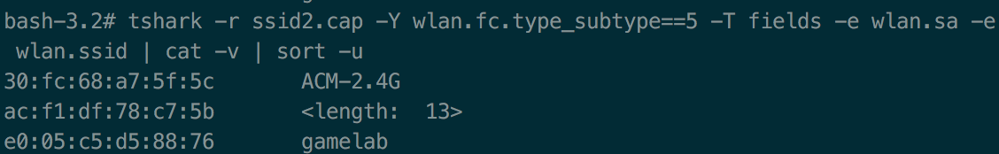

# 移动互联网安全-第二章-无线接入网监听-实验报告
- 在回答问题之前我们先来梳理一下回答问题所需的知识

### 无加密WiFi连接/认证交互过程
1. **AP广播Beacon帧** Beacon帧中包含了SSID，Source address等信息。如果有意隐藏，AP也可以在Beacon帧中令SSID为空字符串。如果没有隐藏，那么STA在收到Beacon帧后并获得了用于与该AP进行连接的必要信息（所以手机的WiFi列表里才会出现该SSID）
2. **STA定向发送Probe Request帧** STA向指定的SSID发送Probe Request帧以请求连接。对于隐藏了SSID（或根本没有发送Beacon帧）的AP，如果Probe Request帧中的SSID填写正确，那么目标AP仍然可以进行正常应答
3. **AP回复Probe Response帧** AP回复Probe Response表明自己收到了STA的Probe Request并且准许进行下一步动作——身份认证
4. **STA定向发送Authentication请求进行身份认证** 
5. **AP回复Authentication** 该Authentication总包含一个Status code字段。如果值为Successful，表明接受STA的身份
6. **STA定向发送Association请求连接**
7. **AP回复Association Response** 至此，无加密WiFi连接时的身份认证就结束了，双方就可以正常进行数据传输了

---
- 梳理完之后，我们再来回答问题

### 查看统计当前信号覆盖范围内一共有多少独立的SSID？其中是否包括隐藏SSID？
- 独立SSID，要么能通过AP广播Beacon帧被我们识别，要么通过回复Probe Response被我们识别。而其中①不广播Beacon只回复Probe Response或②广播Beacon但SSID为空的，可以被认为是隐藏SSID
- 首先获取所有广播了Beacon的AP的SSID:可以看到，有一个AP在广播的Beacon帧中放入的是空SSID
- 接下来再来获取所有回复了Probe Response的AP的SSID:可以看到，第一张截图中的隐藏SSID其实是`<length:  13>`
- 回答问题：当前信号覆盖范围内一共有3个独立SSID，其中包括一个隐藏SSID

### 哪些无线热点是加密/非加密的？加密方式是否可知？
- 非加密其实也算一种加密方式。加密方式可以通过`wlan.fixed.auth.alg`字段来（对有该字段的帧）进行获取
- 
- 可以看到，在抓包期间，只有`<length:  13>`这个热点与STA进行了身份认证，其中用到的方式是0，即无加密方式（Open System)

### 如何分析出一个指定手机在抓包时间窗口内在手机端的无线网络列表可以看到哪些SSID？这台手机尝试连接了哪些SSID？最终加入了哪些SSID？
- 当收到了AP广播的Beacon帧且SSID不为空时，指定手机才能在无线网络列表中看到该SSID
- 通过获取该手机定向往哪些SSID发送了Probe Request帧可以判断其尝试连接了哪些SSID
- 通过判断该手机与哪些SSID交互了Association和Association Response帧可以判断该手机最终加入了哪些SSID

### SSID包含在哪些类型的802.11帧？
- 
- 根据所抓取到的包来看，至少以下四种帧包含SSID字段：
	- Probe Request
	- Probe Response
	- Beacon
	- Authentication

