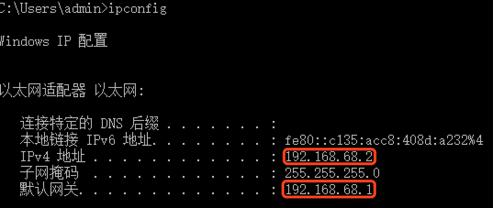
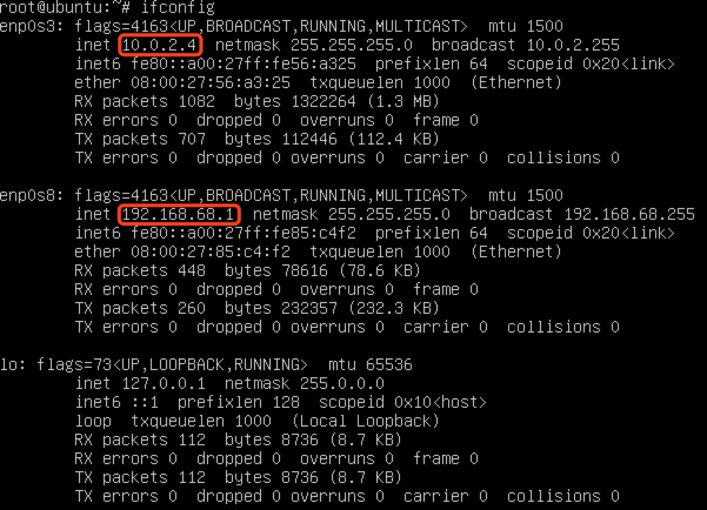
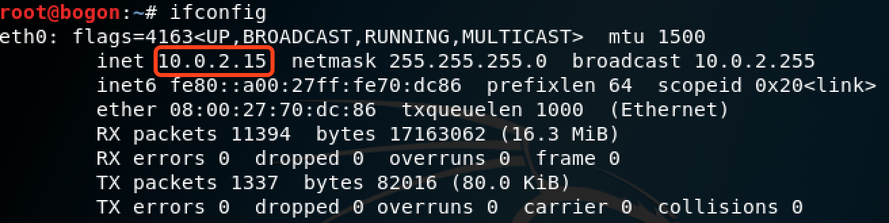

# 实验过程
## 一. 环境搭建
- 首先，分别使用以下iso镜像安装操作系统（所有镜像均可在内部`ftp/iso`目录下获取）
	- Victim: `cn_windows_10_enterprise_x64_dvd_6846957.iso`
	- Gateway: `ubuntu-18.04-live-server-amd64.iso`
	- Attacker: `kali-linux-2018.3-amd64.iso`
- 为了避免不必要的错误
	- Gateway与Attacker在安装完毕后都以`root`身份执行了`apt update && apt upgrade -y && apt dist-upgrade -y`）
	- Victim与Attacker在安装完毕后都安装了增强功能（其中Attacker的增强功能是使用`apt install virtualbox-guest-x11`安装的）
	- Victim在安装完毕后关闭了防火墙
- 随后，为三个节点配置网卡如下：
	- Victim:
		- 只有一块Internal Network网卡 
		- 
	- Gateway: 
		- 有一块Internal Network网卡（enp0s8）与一块Nat Network网卡（enp0s3）
		- 
	- Attacker:
		- 只有一块Nat Network网卡
		- 
	- 上述四块网卡中两块Internal Network网卡处于同一子网中，两块Nat Network网卡处于同一Nat Network中
- 到此，经测试，发现Victim与Gateway的两块网卡可以相互ping通，Attacker与Gateway的外网网卡可以相互ping通，但Victim与Attacker不能相互ping通

## 二. 配置转发
- 尝试使Victim ping Attacker，发现总是超时
	- 
- 监听一下Gateway的两块网卡，发现Gateway并没有把在内网网卡(enp0s3)上接收到的`echo request`从外网网卡(enp0s8)送出去
	- 
- 原因是因为没有开启Gateway的操作系统的ipv4转发功能。在Gateway上执行`echo 1 > /proc/sys/net/ipv4/ip_forward`以开启该功能，稍后再次尝试，可以看到Gateway已经把在内网网卡上接收到的echo request从外网网卡送出去了
	- 
- 不过此时Victim上仍然显示`请求超时`。从上面的结果我们也能看到Gateway没有收到来自Attacker的echo reply。进一步监听Attacker的网卡，发现Attacker回复了`echo reply`，只不过目标地址是`192.168.68.2`这么个内网地址，而Attacker所在的网络里是没有这个ip的（就算有也不是我们的Victim）
	- 
- 为了使`echo reply`包能正确经由Gateway返回到Victim，需在Gateway中使用`iptables`配置防火墙并保存配置
	- 
- 然后再使Victim ping Attacker，发现可以ping通了。通过监听网卡可以发现，`echo request`包在经由Gateway转发时，源ip已经由Victim的`192.168.68.2`变成了Gateway的`10.0.2.4`。而Attacker回复的`echo reply`包在经由Gateway转发时，目标ip也从Gateway的`10.0.2.4`变回成了Victim的`192.168.68.2`，从而实现了Victim ping通Attacker
	- 
	- 
	- 

## 三. 实验结果
### 连通测试
- 靶机访问攻击者主机（已测试）
- 攻击者无法直接访问靶机（根据上文配置转发之前的内容可知这条成立）
- 网关访问靶机和攻击者主机
	- 
	- 
- 所有主机均能访问互联网
	- 目前Victim没有配置DNS服务器，所以无法通过域名进行访问。这里使用阿里云的公共DNS服务器`223.6.6.6`与`223.5.5.5`作为其DNS服务器（这里有个问题，下面有说）
		- 
	- 随后，各个主机都能通过域名访问外部网站了
		- 
		- 
		- 

### 多重加载的基础镜像
- 
- 
- 

## 四. 实验过程中遇到的问题
1. Ubuntu 18.04 Server第二块网卡的配置问题（已解决）
	- 在虚拟机的设置界面中添加第二块网卡后，发现`ifconfig`的输出中没有第二块网卡
	- 当我打开`/etc/network/interfaces`时，我看到的是以下内容：
		- 
	- 而`/etc/netplan`是一个目录，目录下只有一个文件，内容如下：
		- 
	- 于是我`cp`了一下此文件，命名为`01.yaml`，并如下修改文件中的内容：
		- 
	- 随后以`root`身份执行`netplan apply`，短暂的等待后，便能在`ifconfig`中看到第二块网卡了
2. Gateway重启后之前配置的转发失效的问题（已解决）
	- 不知道为什么每次重启后`iptables-save`的输出就是空了。需要每次重启后或手动或写入`.bashrc`中再执行一遍前文配置转发规则的命令才能使Victim正确ping通Attacker
3. Victim的DNS服务器问题（未解决）
	- 如前文所述，我最后使用了阿里云的公共DNS服务器才使Victim能够查询域名了。然而我本意是希望Victim将查询域名的请求发给Gateway，由Gateway完成域名解析的工作并返回结果。通过`cat /etc/resolv.conf`我认为Gateway的本地DNS服务器为127.0.0.53，所以我希望将且只将来自Victim的发往本地53端口的请求转发给127.0.0.53。网上的方法基本都是用`iptables`，但具体命令都不太一样**而且还没有一个能使的**。不得已我只能使用公共DNS服务器
