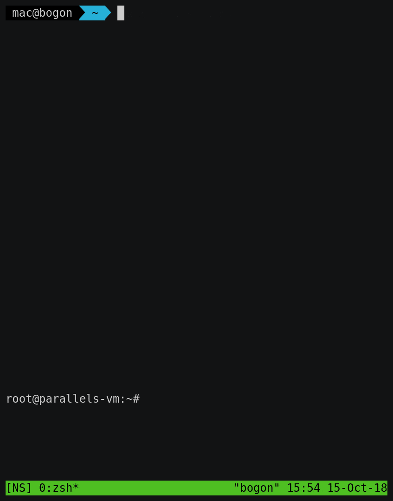
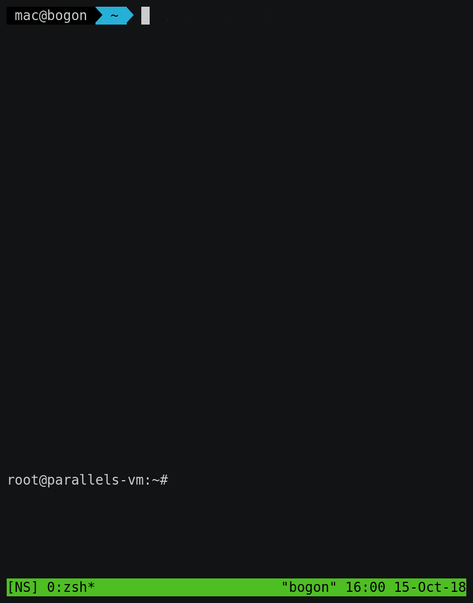

# 常见网络扫描方式编程实践实验报告
## 1 实验要求及完成情况
- 实验要求
	- [x] `TCP connect scan` / `TCP stealth scan`
	- [x] `TCP Xmas scan` / `TCP fin scan` / `TCP null scan`
	- [x] `UDP scan`
- 这里之所以
	- 将`TCP connect scan`与`TCP stealth scan`列为一项
	- 将`TCP Xmas scan`、`TCP fin scan`及`TCP Null scan`列为一项  
	
	是因为它们的扫描流程非常相似。其中
	
	- `TCP connect scan`与`TCP stealth scan`都是先发送一个S，然后等待回应。如果有回应且标识为`RA`，说明目标端口处于关闭状态；如果有回应且标识为`SA`，说明目标端口处于开放状态。这时
		- `TCP connect scan`会回复一个`RA`，在完成三次握手的同时断开连接
		- `TCP stealth scan`只回复一个`R`，不完成三次握手，直接取消建立连接
	- `TCP Xmas scan`、`TCP fin scan`及`TCP Null scan`不涉及三次交互。它们都是先发送一个包，然后根据目标主机是否回复`R`来目标端口的状态。不同的是：
		- `TCP Xmas scan`发送的是`FPU`
		- `TCP fin scan`发送的是`F`
		- `TCP Null scan`发送的包里没有设置任何`flag`

## 2 环境准备
- 端口状态大概可分为以下几种：
	- 开放的TCP端口
	- 开放的UDP端口
	- 关闭的端口
	- 不可达的端口（这条严格来说算是主机状态）
- 所以本实验需要准备以上4种端口。其中
	- 开放的TCP端口可通过一条指令实现：
		<pre>
		$ python -m SimpleHTTPServer 80
		Serving HTTP on 0.0.0.0 port 80 ...
		</pre>
	- 开放的UDP端口可通过以下几行`python`代码实现：
		<pre>
		>>> import socket
		>>> addr = <本机的ip地址>
		>>> port = <希望监听的端口>
		>>> s = socket.socket(socket.AF_INET, socket.SOCK_DGRAM)
		>>> s.bind((addr, port))
		</pre>
	- 关闭的端口很好实现，除了开放的端口剩下的都是关闭的端口
	- 不可达的端口也很好实现，指定一个不可达（甚至根本不存在）的主机即可
- 本实验中的网络拓扑十分简单，只涉及两台主机：
	- 宿主机（10.37.129.2）
	- 虚拟机(10.37.129.3)  
	
	其中宿主机是被扫描者，虚拟机是扫描者。
- 按前文所述方式准备端口如下：

	IP | Port | TCP/UDP | 描述
	:-: | :-: | :-: | :-:
	10.37.129.2 | 80 | TCP | 在线主机上的开放TCP端口
	10.37.129.2 | 53 | UDP | 在线主机上的开放UDP端口
	10.37.129.2 | 443 | - | 在线主机上的关闭端口
	10.37.129.5 | 80 | - | 离线主机上的端口

## 3 实验过程
- 本实验构造自定义包以及发送包的工具为`python scapy(v2.4.0)`
- 在正式发包之前，我们先定义一些辅助函数以简化发包流程（辅助函数完整源代码见[scan.py](scan.py)）

### 辅助函数
1. 可以想到的是我们肯定需要一个能快速生成预期的包的方法。为此我们定义`new_tcp_pkt`与`new_udp_pkt`两个函数，给定参数，快速生成包。函数原型：
	- `new_tcp_pkt(src_ip, dst_ip, dst_port, flags, src_port=None, seq=None, ack=None)`
	- `new_udp_pkt(src_ip, dst_ip, dst_port, src_port=None)`
	
	其中：
	
	- 当`src_port`为`None`时，函数会随机生成一个49152~65535（动态端口与私有端口所在区间）之间的数字作为`src_port`
	- 当`seq`为`None`时，函数会随机生成一个0~65535之间的数字作为`seq`
		

2. 根据前文所述，我们需要模拟三种扫描类型：
	- `TCP connect scan` / `TCP stealth scan` 这样涉及三次交互的TCP扫描
	- `TCP Xmas scan` / `TCP fin scan` / `TCP null scan` 这样涉及两次交互的TCP扫描
	- 以及`UDP scan`
	
	对于第一类扫描模式，可以先定义一个基础函数`_tcp_scan_3`，再从这个基础函数延伸出具体的扫描函数：
	
		def get_flags_of_tcp_pkt(pkt):
			rv = ''
			if pkt and pkt.haslayer('TCP'):
				rv = pkt.getlayer('TCP').flags
			return rv

		def _tcp_scan_3(src_ip, dst_ip, dst_port, flags):
			pkt1 = new_tcp_pkt(src_ip, dst_ip, dst_port, 'S')
			pkt2 = sr1(pkt1, timeout=1, verbose=0)
			if get_flags_of_tcp_pkt(pkt2) == 'SA':
				pkt3 = new_tcp_pkt(src_ip, dst_ip, dst_port, flags, src_port=pkt1.sport, seq=pkt1.seq+1, ack=pkt2.seq+1)
				send(pkt3, verbose=0) # 置verbose为0以去除默认输出

		tcp_connect_scan = partial(_tcp_scan_3, flags='RA')
		tcp_stealth_scan = partial(_tcp_scan_3, flags='R')
	如上所示，基础函数`_tcp_scan_3`的作用是向目标端口发送`S`，并在有回应且回应的标识为`SA`的情况下回复`flags`  
	类似的，对于第二类扫描模式，可以如下定义：
	
		def _tcp_scan_2(src_ip, dst_ip, dst_port, flags):
			pkt = new_tcp_pkt(src_ip, dst_ip, dst_port, flags)
			send(pkt, verbose=0) # 置verbose为0以去除默认输出

		tcp_xmas_scan = partial(_tcp_scan_2, flags='FPU')
		tcp_null_scan = partial(_tcp_scan_2, flags='')
		tcp_fin_scan = partial(_tcp_scan_2, flags='F')
	如上所示，基础函数`_tcp_scan_2`的作用是向目标端口发送`flags`  
	至于`UDP scan`，就直接定义即可
	
		def _udp_scan(src_ip, dst_ip, dst_port):
			pkt = new_udp_pkt(src_ip, dst_ip, dst_port)
			send(pkt, verbose=0)  # 置verbose为0以去除默认输出
		udp_scan = _udp_scan
	如上所示，其作用就是向目标端口发送一个空UDP包  
	定义完这些辅助函数后，我们就可以开始发包测试了

### 开始发包
#### (1) TCP connect scan
- 扫描过程如下所示：
	
- 可以看到，当`S`发往一个开放的`TCP`端口时，目标主机会回复一个`SA`，此时本机回复了`RA`；否则会回复一个`RA`；当目标主机不可达时，本机收不到任何响应
- 这种扫描方式的优点是，建立TCP连接不需要根用户授权；缺点是三次握手实质上已经完成，连接其实已经建立，容易被目标主机上的某些软件记录下来

#### (2) TCP Stealth scan
- 扫描过程如下所示：
	- 
- 可以看到，与TCP connect scan不同的是，当收到`SA`时，本机回复的是`R`而非`RA`。其余时候与TCP connect scan表现一致
- 这种扫描方式的优缺点恰好相反：三次握手没有实际完成，连接没有建立，不容易被记录；同时由于其非标准握手流程，所发的包都是自己构造的，所以需要根用户授权

#### (3) TCP xmas scan / TCP null scan / TCP fin scan
- TCP xmas scan的扫描过程如下所示：
	- 
- 可以看到，对于开放的端口，发送了`FPU`的本机不会收到任何响应；对于未开放的端口，目标主机会回复`RA`；对于不可达的主机，自然也是没有任何回应了。
- 对于[TCP null scan](images/tcp_null_scan.cast.gif)和[TCP fin scan](images/tcp_fin_scan.cast.gif)，其表现完全一致，这里给出图片链接，不再直接在此处展示

#### (4) UDP scan
- 扫描过程如下所示（注意此时`tcpdump`命令中的协议换成了`udp`和`icmp`）：
	- 
- 可以看到，对于未开放的`UDP`端口，目标主机会回复`ICMP`包，告知本机`udp port unreachable`；对于开放的`UDP`端口，目标主机是否会有回应取决于监听在目标端口上的软件。本例中目标主机的上的`UDP`端口由我们前文提到的程序监听，自然是没有任何回应

至此，各种扫描模式已经展示完毕

## 4 实验中遇到的问题
### (1) sr1自动回复RST
- 实验过程中曾经出现过这样的问题：在TCP connect scan中，监听结果显示，当收到第二次握手包后，本机会自动回复`R`，随后`scapy`又回复了一个`RA`。这个问题困扰了我很久，我一直以为这个是`sr1`的问题。直到看到[这篇文章](https://www.packetlevel.ch/html/scapy/scapy3way.html)，我才知道原来是操作系统自己回复的。因为操作系统确实没有监听我们发第一次握手包时所用到的端口，所以对于外部来的`SA`，操作系统自然会回复`R`。解决方式在上述文章中有，就是通过设置`iptables`使操作系统不回复这个`R`即可

### (2) NoneType - int
- 实验过程中曾经报过这样的错：`TypeError: unsupported operand type(s) for -: 'NoneType' and 'int'`
	最后发现是构建`pkt`的时候置`ack`参数默认为`None`引起的。在函数中增加一条`ack = ack or 0`即可

### (3) 通过ssh连接的终端执行python3使会有UnicodeEncodeError  
- 在宿主机通过`ssh`登入虚拟机执行`python3 main.py`的时候，如果`main.py`里有中文字符，那么会报`UnicodeEncodeError`，然后在虚拟机里直接执行时却不会。这个问题可太奇怪了，我也不知道我最后是怎么搜到[这篇文章](https://www.jianshu.com/p/d805f7be08fa)的。总之就是本机在通过`ssh`连接外部主机时会顺便把一些和本地语言环境相关的环境变量给传过去，而那些环境变量会影响`python3`的编解码。解决方式如文章中所说，手动指定相关变量的值即可

## 5 个人体会与感悟
- 个人认为，其实所谓“如果发生了什么什么的行为那么说明这个端口处于怎样怎样的状态”之类的表述，应该只适用于一般情况？换句话说，目标主机的行为完全是由目标主机的管理员决定的。除了离线主机确实只能是离线主机以外，在线主机其实可以任意模拟出它希望让扫描者认为
他所处于的状态，包括开放、关闭、过滤、离线，等等，反正回复不回复，如果回复那回复什么，这些事情还不是由目标主机说了算的。
