# 从SQL注入到Shell


# 实验过程

## 一. 环境搭建
- 首先, 在[PentesterLab](https://pentesterlab.com)的**[From SQL Injection to Shell](https://pentesterlab.com/exercises/from_sqli_to_shell)**课程网站上[下载](https://pentesterlab.com/exercises/from_sqli_to_shell/iso)靶机镜像文件`from_sqli_to_shell_i386.iso`
- 使用`VirtualBox`创建虚拟机并为其分配两块网卡
	- 一块NAT网卡用于上网
	- 一块Host-Only网卡用于宿主机的正常访问(或一块Internal网卡用于其他处于同一局域网内的虚拟机的正常访问)
- 开机后, 回车或什么都不做以自动选中**Live**模式
	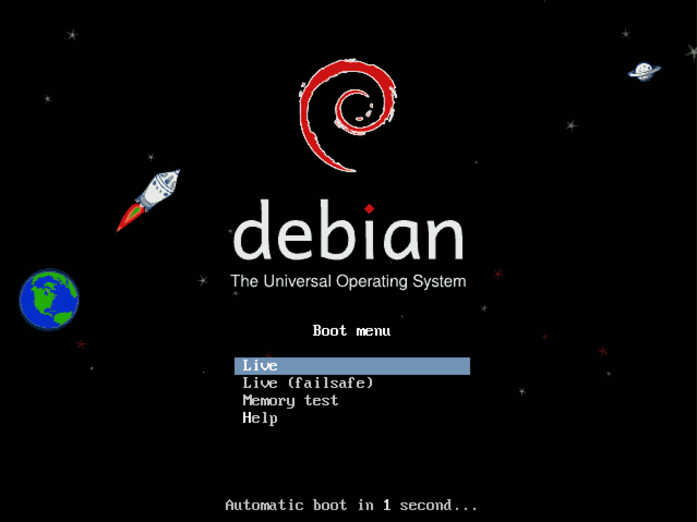
- 经过一段短暂的加载滚屏后, 当出现`user@debian:~$`提示符后即表明加载完成
	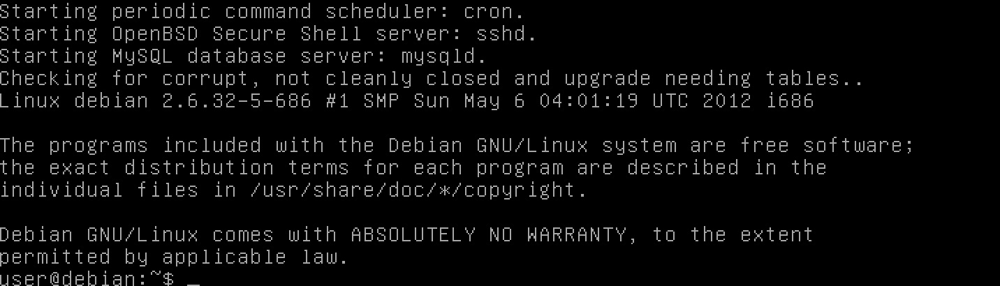
- 此时执行`ifconfig eth1`以查看Host-Only网卡的IP地址
	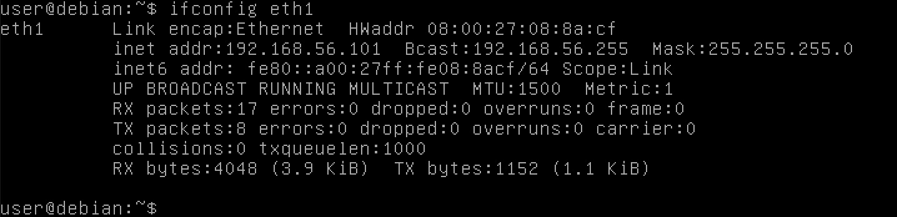  
	可以看到其IP为`192.168.56.101`
- 在宿主机上访问该IP地址, 若出现网站首页则说明环境搭建成功
	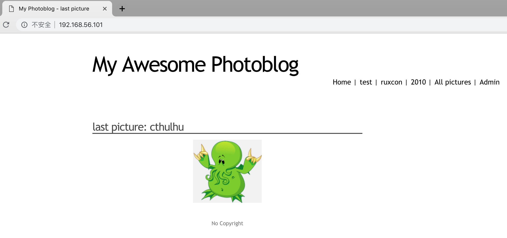

## 二. 注入过程
- 大致思路: 
	1. 通过SQL注入获取网站管理员用户的账户密码
		1. 找到一个注入点
		2. 通过`order by`来判断查询返回的列数
		3. 通过`union select 1, 2, 3 ...` 来判断被输出的列
		4. 通过`union select`来获取其他信息(如管理员用户的账户密码)
	2. 以网站管理员身份上传webshell

### 1. SQL注入
- 容易发现一个可能的注入点: `http://192.168.56.101/cat.php?id=xxx`
	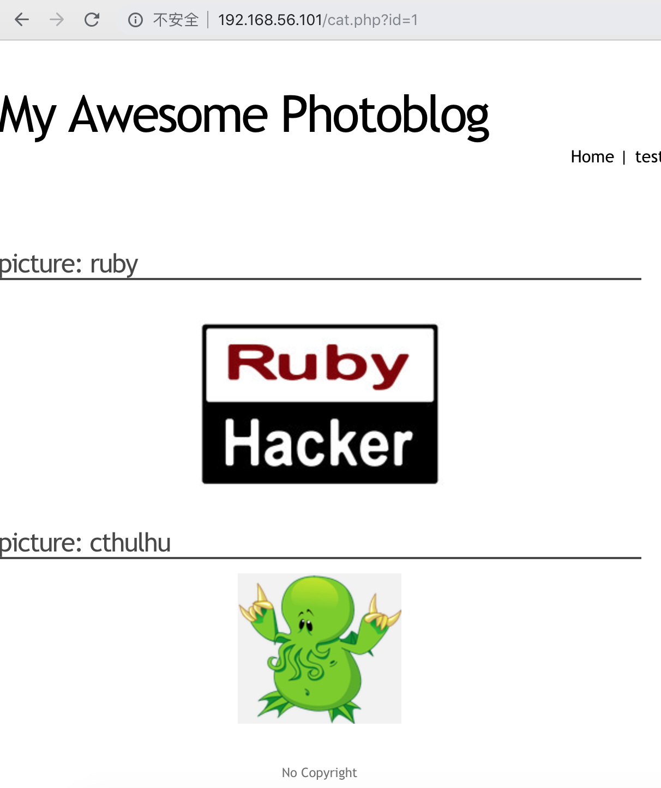
- 先尝试将参数`id`的值改为`2-1`, 然后重新访问. 如果返回的是`id=2`的内容, 则说明此处可能不太容易进行注入; 如果返回的是`id=1`的内容, 则说明此处很有可能是个注入点
- 这里返回的是`id=1`的内容, 说明此处是一个注入点
	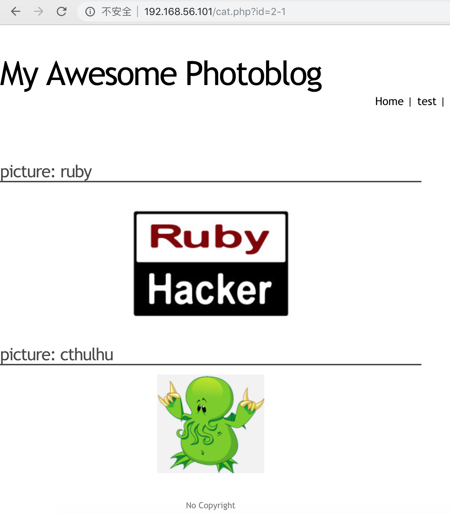
- 将`id`的值改为`1 order by 4`, 发现结果正常返回; 而当其值为`1 order by 5`时, 则返回了SQL的错误信息. 这说明查询的返回结果中有4列
	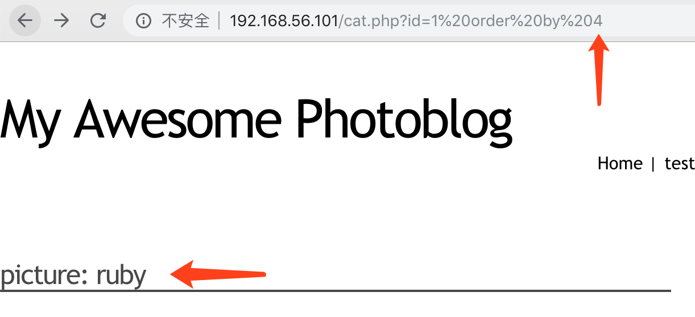
	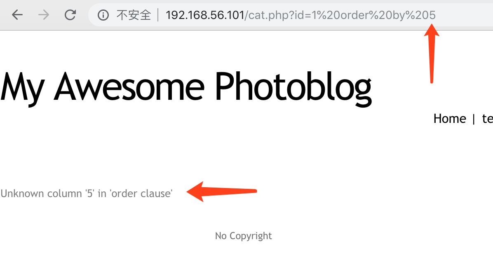
- 然而此时我们并不知道被输出的"图像名"属于哪一列. 所以我们将`id`改为`1 union select 1, 2, 3, 4`,可以看到名为"2"的图像被查找到了, 说明第二列是图像名, 是可以被输出的信息
	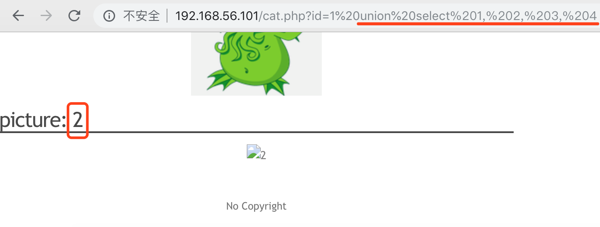
- 这时, 我们希望获取的内容位于`infomation_schema.columns`表的`table_name, column_name`两个字段中. 由于这里我们只有一列的内容被输出, 所以我们需使用`concat`函数将这两个字符串进行拼接. 因此, 我们将上面的`2`改为`concat(tablename, ':', column_name)`并在末尾添加`from infomation_schema.columns`, 进行访问, 可以看到输出了很多结果:
	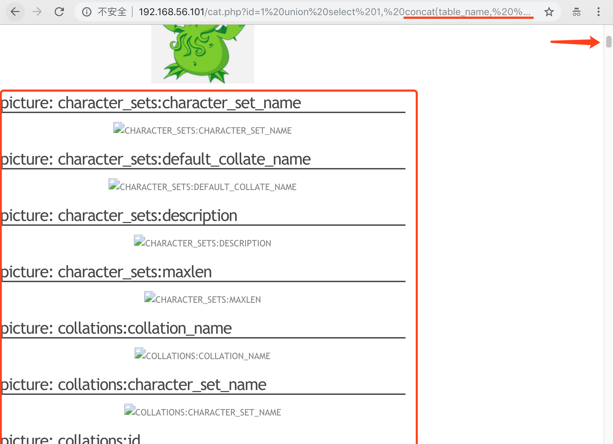
- 在结果中可以发现一个疑似存储用户信息的表`users`
	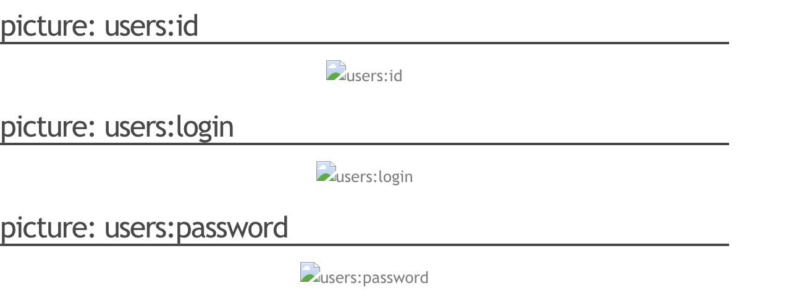
- 将这两个字段进行筛选, 即得到`admin`与`8efe310f9ab3efeae8d410a8e0166eb2`,显然后者有很大概率是个哈希值. 尝试直接使用其作为密码进行登录, 发现确实不行, 故准备根据哈希值反推原密码
	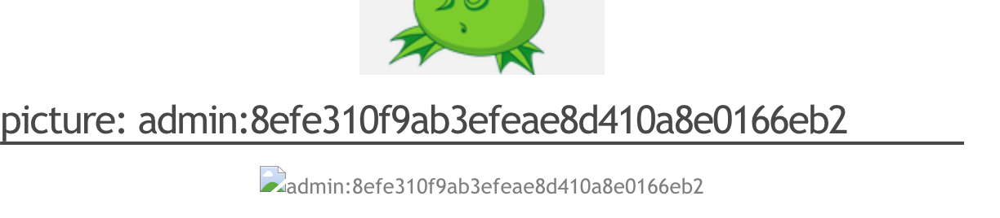
- 首先猜想其可能是直接`md5`哈希值. 通过本地工具或在线网站, 容易得到其正是`P4ssw0rd`的直接`md5`哈希值. 尝试使用其作为`admin`的密码进行登录, 成功
	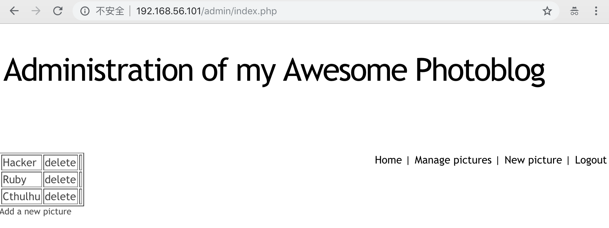

### 2. 上传WebShell
- 首先在本地编写好WebShell并暂时命名为`123.php`

	```php
	<?php
	system($_GET['cmd']);
	```
- 尝试将其通过上传图片的方式进行上传, 发现网站识别出了其为php并且拒绝了此次上传
	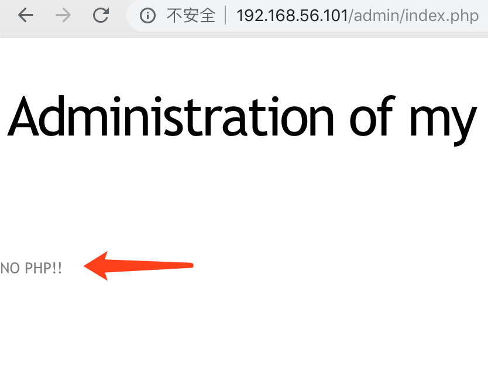
- 将其更名为`123.png`, 重新上传, 发现上传成功
	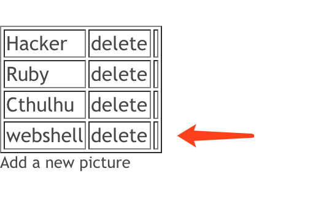
- 在管理员页面点击"图片名"`webshell`,进入到该图片的访问页面. 在网页源代码中找到其所在位置为`admin/uploads/123.png`
	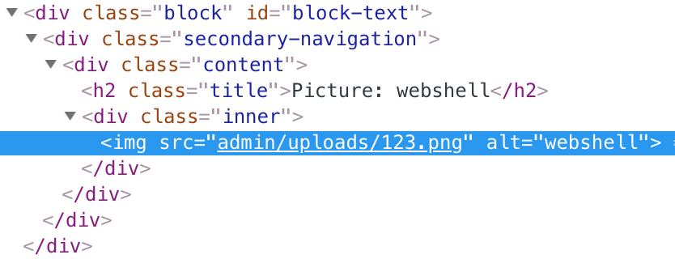
- 在地址栏中直接访问该地址, 发现该文件**虽然被正常获取但是却被服务器当成png图片进行了返回, 而没有将其当成php脚本来执行**
	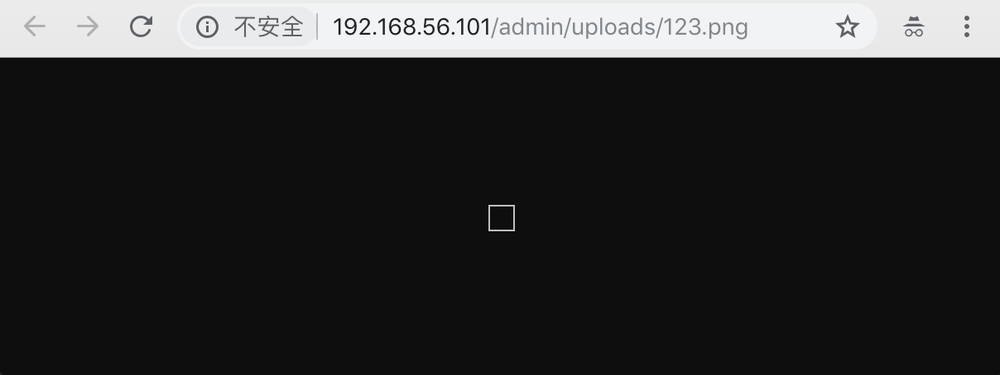
- 将文件名改为`123.php.fk`重新上传, 发现这次该文件执行正常, `WebShell`成功建立
	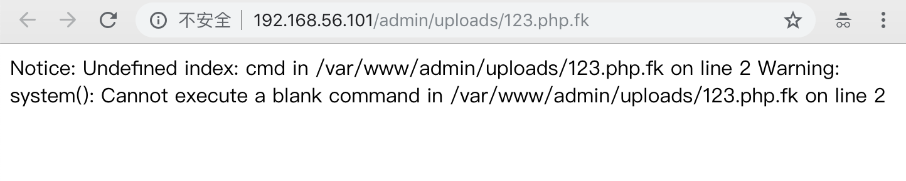
- `cmd`参数可以被当成指令正确执行(在Chrome中, 为方便查看输出结果可以使用*显示网页源代码*模式)
	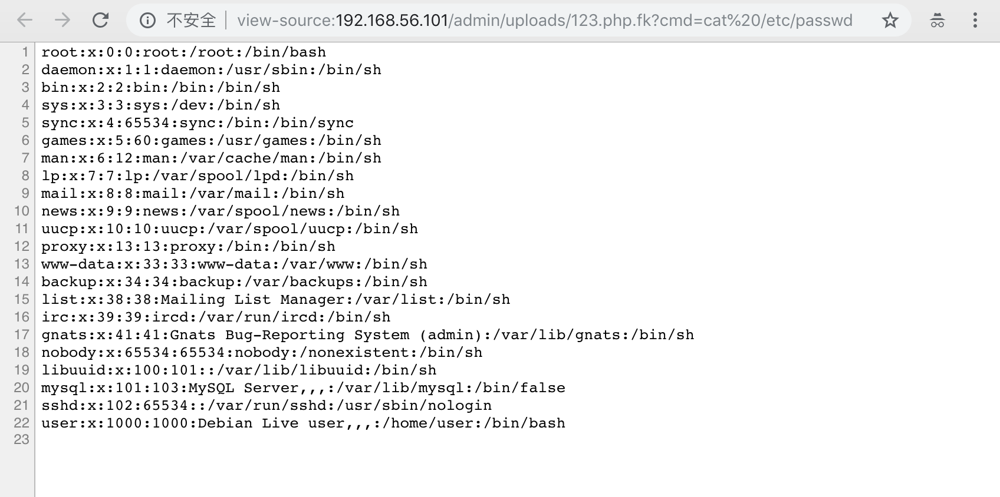
- 至此, `WebShell`上传成功
