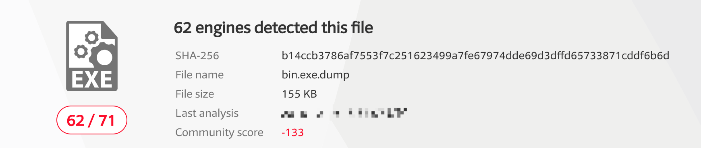
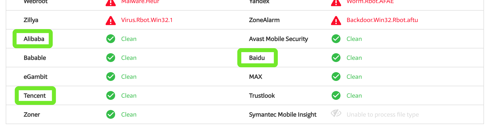

# 实战bro网络入侵取证


# 简介
- 本实验将以[该pcap包](http://sec.cuc.edu.cn/huangwei/textbook/ns/chap0x12/attack-trace.pcap)为例简单体验一下bro的基本功能
- 本实验将使用bro实现:
	- 解析流量, 形成日志
	- 提取流量中所有传输的文件
	- 查找指定文件的来源

# 实验过程
## 一.环境准备
- 一台虚拟机
	- iso: [kali-linux-2018.3-amd64.iso](http://sec.cuc.edu.cn/ftp/iso/kali-linux-2018.3-amd64.iso)
	- 网卡模式: 任意, 建议连接互联网
- 安装bro
	```bash
	export DEBIAN_FRONTEND=noninteractive
	apt-get install -y bro bro-aux
	pro -v  # bro version 2.5.5
	```
- 配置bro
	- 在`cd /etc/bro/site`下新建`ignore_checksums.bro`文件, 并写入以下内容以使bro引擎忽略校验和:
		```
		redef ignore_checksums = T;
		```
	- 修改该目录下的`local.bro`, 在文件尾追加以下内容:
		```
		@load frameworks/files/extract-all-files
		@load ignore_checksums.bro
		```
		其中第一条为bro自带的提取文件的规则, 第二条为我们自己写的忽略校验和的规则

## 二.开始分析
- 新建一个空目录, 将样例pcap包放入其中并使用bro对其进行解析
	```bash
	wget https://sec.cuc.edu.cn/huangwei/textbook/ns/chap0x12/attack-trace.pcap  # 若联网则使用wget下载即可
	bro -r attack-trace.pcap /etc/bro/site/local.bro
	```
	执行完毕后, 可以在当前目录看到输出了若干`.log`文件以及一个`extracted_files`目录
	```bash
	# ls
	attack-trace.pcap  conn.log	  files.log  loaded_scripts.log  pe.log
	capture_loss.log   extract_files  ftp.log    packet_filter.log	 stats.log
	```
- 可以看到`extracted_files`目录下只有一个文件. 使用`file`命令查看其文件类型, 可以看到这是一个Windows上的可执行文件
	```bash
	# file `ls`
	extract-1240198114.648099-FTP_DATA-FHUsSu3rWdP07eRE4l: PE32 executable (GUI) Intel 80386, for MS Windows
	```
- 尝试将其上传至[VirusTotal](https://www.virustotal.com)进行分析, 得到以下结果([在线查看](https://www.virustotal.com/#/file/b14ccb3786af7553f7c251623499a7fe67974dde69d3dffd65733871cddf6b6d/detection)):
	
- 那么现在准备获取该文件的发送者ip. 首先需要找到bro对提取文件的命名规则. 在`/usr/share/bro/base/files/extract/`目录下, `main.bro`文件中, 可以看到以下代码段:
	```
	function on_add(f: fa_file, args: Files::AnalyzerArgs)
		{
		if ( ! args?$extract_filename )
			args$extract_filename = cat("extract-", f$last_active, "-", f$source, "-", f$id);
		f$info$extracted = args$extract_filename;
		args$extract_filename = build_path_compressed(prefix, args$extract_filename);
		f$info$extracted_cutoff = F;
		mkdir(prefix);
		}
	```
	观察其中`cat`函数的调用方式, 大概能猜到文件的唯一标识符`id`就是文件名以`-`为分割符进行分割后的最后一部分. 上述文件的`id`即为`FHUsSu3rWdP07eRE4l`
- 在分析得到的`files.log`中查找包含该字符串的行, 发现该文件来源于网络传输, 同时可以看到发送者ip为98.114.205.102
	```bash
	# cat files.log | grep FHUsSu3rWdP07eRE4l
	1240198114.648099	FHUsSu3rWdP07eRE4l	98.114.205.102	192.150.11.111	CTUZSt2ngI5TiTwW2e	FTP_DATA	0	MD5,SHA1,EXTRACT,PE	application/x-dosexec	-	9.767306	-	T	158720	-	0	0	F	-	14a09a48ad23fe0ea5a180bee8cb750a	ac3cdd673f5126bc49faa72fb52284f513929db4	-	extract-1240198114.648099-FTP_DATA-FHUsSu3rWdP07eRE4l	F	-
	```
- 至此, 我们便简单地体验了一下bro的基本功能, 算是小小地感受了一下bro这个工具的强大

# 一些疑问
1. 在VirusTotal给出的[分析结果](https://www.virustotal.com/#/file/b14ccb3786af7553f7c251623499a7fe67974dde69d3dffd65733871cddf6b6d/detection)中, 71个引擎里有62个报毒, 剩余的9个里居然包含了**Tencent**, **Alibaba**, **Baidu**? 这是否说明这些公司在安全领域的能力其实很差呢?
	
